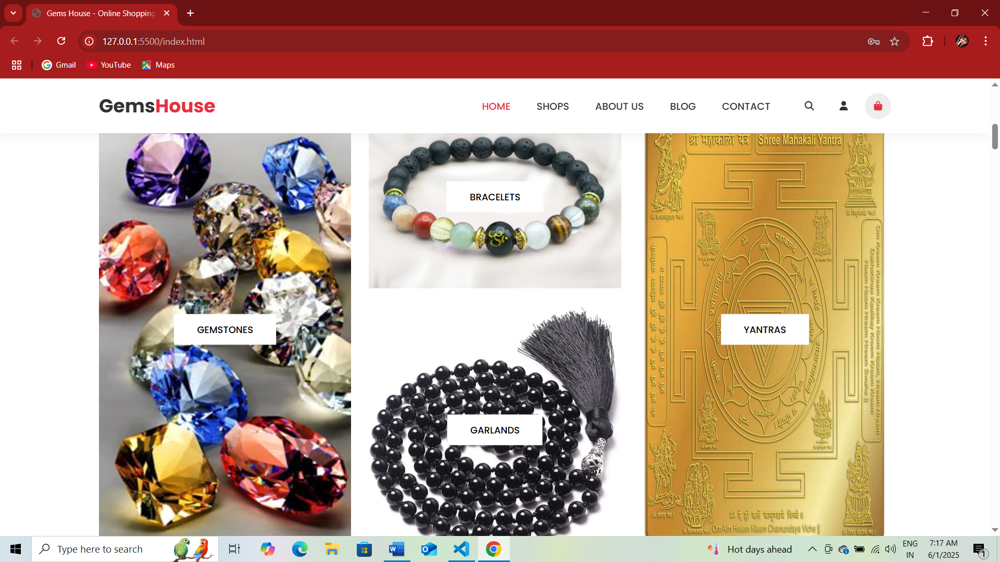

# GEMSHOUSE - The House of Aura Enlightenment

1. Gemshouse is an **online shopping website** specializing in gemstones, bracelets, garlands, yantras, and spiritual items.
2. It is designed to combine **traditional Indian cultural aesthetics** with modern e-commerce features.
3. This is a Spring Boot + MySQL backend and frontend project for GEMSHOUSE.

----

## Features
**Product Browsing** - View products by category (Bracelets, Garlands, Yantras, Gemstones)
**Search & Filter** - Quickly find products of interest
**Wishlist** - Save products for later
**Cart Management** - Add/remove products and proceed to checkout
**User Authentication** - Login & Signup using Spring Boot backend
**Order Management** - Place and track orders
**Responsive Design** - Works on desktop and mobile devices

----

## Tech Stack

### **Frontend**
-HTML5, CSS3, Javascript
-Responsive design with media queries
-Category-wise product display

### **Backend**
-Java with Spring Boot
-REST API for product, cart, wishlist, and order management
-Spring Security for authentication

### **Database**
-MySQL
-Tables:
    -`users`
    -`products`
    -`cart`
    -`wishlist`
    -`orders`

----

## How to Run

1. Install Java 21 and Maven.
2. Run `mvn clean install` in the backend folder.
3. Run `mvn spring-boot:run` to start the backend server.

----

## Configuration

Edit `backend/src/main/resources/application.properties` for database settings.

----

## Frontend Setup
- Use a local server like Live server in VS Code.

----

## Screenshots

----

## Testing

- **Unit Testing** - JUnit for backend logic
- **Integration Testing** - API endpoint tests
- **System Testing** - Full workflow testing (product view -> cart -> order placement)

----

## Security
- Password stored with Bcrypt encryption
- Role-based access control for admin and user
- CORS configuration for frontend-backend communication

----

## Future Enhancements
- Online payment integration
- Multi-language support
- Product reviews & ratings
- Real-time order tracking

----

## License

This project is licensed under the MIT License- feel free to use and modify.
